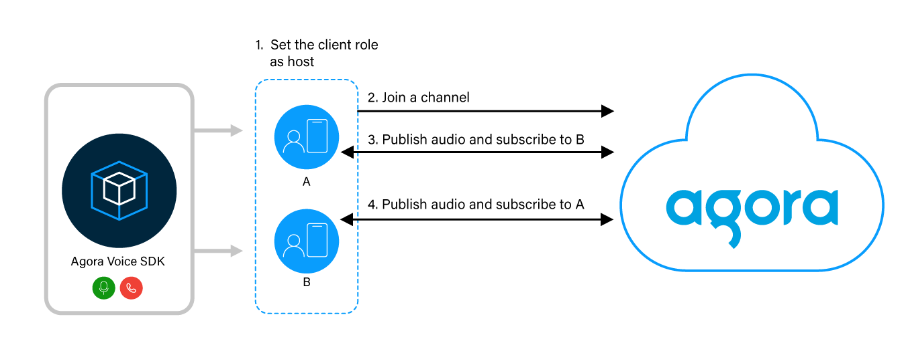

# Video Calling Web App

## Table of Contents

- [LIVE DEMO](#Live-Demo-link)
- [YOUTUBE VIDEO](https://youtu.be/Xinb9Fql5qA)
- [Project overview](#Project-overview)
- [Technology](#Technology)
- [Key Features](#Key-Features)
- [How to run application locally ?](#How-to-run-application-?)
- [Why agora ?](#agora)
- [How agora works ?](#How-webRTC-(agora)-works-?)

<div id="Live-Demo-link"/>

### [Live Demo link](https://webvc.up.railway.app)

<div id="Project-overview"/>

### Project overview:
This project is a web video calling application that utilizes the [Agora Real-Time Communication (RTC) SDK](https://www.agora.io/en/) to enable real-time video communication between users. The application incorporates essential features such as user signup, forget password capability, password matching functionality for the signup page, and additional controls for the video call experience, including mic mute/unmute, camera mute/unmute, and end call functionality.

The application aims to provide a seamless and intuitive user experience for web-based video calling, with added functionality for user management and call control. By leveraging the Agora RTC SDK, it ensures reliable and efficient real-time communication between participants.

<div id="Technology"/>

### Technology:
1. WebRTC (agora)
2. Python (Django)
3. Database (PostgreSQL)
4. HTML, JavaScript, CSS, Bootstrap 
5. Host server on [railway](https://railway.app/)

<div id="Key-Features"/>

### Key Features:
1. **Video Calling:** The application allows users to initiate video calls with other participants in real time. It leverages the Agora RTC SDK to establish reliable and high-quality video communication.

2. **User Signup:** Users can create new accounts by registering their credentials, including username, email address, and password. The signup process ensures password matching functionality to validate accurate password input.

3. **Forget Password:** If users forget their passwords, they can utilize the "Forget Password" feature to initiate a password reset process. This typically involves sending a password reset link or verification code to the user's registered email address.

4. **Mic Mute/Unmute:** During a video call, participants can easily control their microphone's audio input by toggling the mic mute/unmute functionality. This allows users to silence or enable their audio as desired.

5. **Camera Mute/Unmute:** Participants can control their camera's video feed during a video call. By using the camera mute/unmute functionality, users can turn off or resume their video streaming according to their preferences.

6. **End Call Functionality:** Users have the ability to terminate ongoing video calls using the end call feature. This action disconnects the call and returns participants to the application's main interface.

7. **Responsive Web Application:** The application is designed to be responsive, ensuring optimal user experience across a variety of devices and screen sizes. It automatically adapts its layout and functionality to provide a seamless video calling experience on desktops, laptops, tablets, and mobile devices.

<div id="How-to-run-application-?"/>

### How to run application locally ?
#### 1 - Clone repo
```
 git clone https://github.com/ShubhamOulkar/webvc.git
```
#### 2 - Create/activate virtual environment in your current directory

#### 3 - Install requirements
```
pip install -r requirements.txt
```
#### 4 - change directory to mainfolders
```
cd mainfolders
```
#### 5 - User text editor to update following code
1. open **mainfolders/webvc/views.py** file and add appId and appCertificate from agora.
    **[How to get appID and appCertificate](https://docs.agora.io/en/voice-calling/reference/manage-agora-account?platform=web)**


2. open **mainfolders/webvc/static/webvc/js/strems.js** add APP_ID here as well.
```
const APP_ID = '**************'
const CHANNEL = sessionStorage.getItem('room')
const TOKEN = sessionStorage.getItem('token')...
```
3. open **mainfolders/mainfolder/settings.py** add EMAIL_HOST_USER(add user gmail) and EMAIL_HOST_PASSWORD.
    if you are using gmail then see [how to get gmail app password.](https://www.getmailbird.com/gmail-app-password/)


#### 6 - run following commands in terminal
```
python manage.py makemigrations
```
```
python manage.py migrate
```

#### 7 - Start server
```
python manage.py runserver
```

<div id='agora'/>

### Why agora?
1. **Pre-built Infrastructure:** Agora provides a robust and scalable infrastructure for real-time communication. Instead of building and maintaining your own infrastructure, Agora offers a ready-to-use solution, eliminating the need for complex server setup, maintenance, and monitoring. This pre-built infrastructure reduces development time and effort significantly.

2. **Comprehensive SDK and APIs:** Agora offers a feature-rich SDK with a comprehensive set of APIs and libraries. These APIs abstract away the complexities of audio and video transmission, network connectivity, media synchronization, and encoding/decoding. Developers can leverage these APIs to handle real-time communication without needing to delve into low-level details.

3. **Cross-platform Compatibility:** Agora RTC SDK supports a wide range of platforms, including web browsers, iOS, Android, Windows, macOS, and Linux. This cross-platform compatibility allows developers to write their code once and deploy it across multiple platforms, saving time and effort in platform-specific development.

4. **Easy Integration:** Agora RTC SDK is designed for easy integration into existing applications. The SDK provides clear documentation, sample code, and tutorials that guide developers through the integration process. Agora also offers SDKs for popular programming languages, making it convenient for developers to work with the language they are comfortable with.

<div id="How-webRTC-(agora)-works-?"/>

### How agora (similar to webRTC) works ?
The following figure shows the workflow you need to implement to integrate Voice Calling feature into your app. 


To implement this logic, you take the following steps:

1. Create an instance of the Agora Engine by calling **AgoraRTC.createClient.**

2. To connect to a channel, call join and pass the app ID, user ID, token, and channel name.

3. Create and publish the audio track:

    Call **createMicrophoneAndCameraTracks** to create an audio track.

4. Publish the audio track by calling publish.

5. When a remote user joins the channel, this app:

    Listens for a **client.on("user-published")** event which returns an **IAgoraRTCRemoteUser** object and a string. The string indicates the type of track.

6. Retrieves the remote track using the fuction **handleUserJoined** and add user by calling **await client.subscribe(user, mediaType)**.

7. Plays the retrieved tracks by calling play.


Following code snippets will give you some idea about agora SDK

1 : Initiate the voice SDK engine
```
// initiate the voice SDK engine
const client = AgoraRTC.createClient({mode:'rtc', codec:'vp8'})
```
2: set required event listners
```
// set required event listners
    client.on('user-published', handleUserJoined)
    client.on('user-left', handleUserLeft)
```
3: join channel
```
// join channel after retrieve of token for channel
    try {
        await client.join(APP_ID, CHANNEL, TOKEN, UID)
    }catch(error){
        console.error(error)
        window.open('/vcRoom/','_self')
    }
```
4: Create audio and video tracks
```
// create audio and video tracks
   localTracks = await  AgoraRTC.createMicrophoneAndCameraTracks()
```
5: push tracks to the channel
```
// push audio and video tracks to channel
    await client.publish([localTracks[0],localTracks[1]])
```
6: add remote user to channel
```
// add remote user to channel, media types are audio or video 
    await client.subscribe(user, mediaType)
```
7: play local video and audio track
```
// play video track for user
    localTracks[1].play(`user-${UID}`)
    localTracks[0].play(`user-${UID}`)
```
8: play remote video
```
// remote user video track
        user.videoTrack.play(`user-${user.uid}`)
```
9: remote user leave
```
// remote user video call leave
    delete remoteUsers[user.uid]
```
10: stop local tracks and leave local user
```
for (let i = 0 ; localTracks.length >i ; i++){
        // stop local tracks
        localTracks[i].stop()
        localTracks[i].close()
    }
    // leave local user
    await client.leave()
```

<div id="license"/>

### License
This project is licensed under the [Apache License.](LICENSE)

Feel free to customize the content and structure of the [README.md](README.md) file according to your specific project requirements and information.
