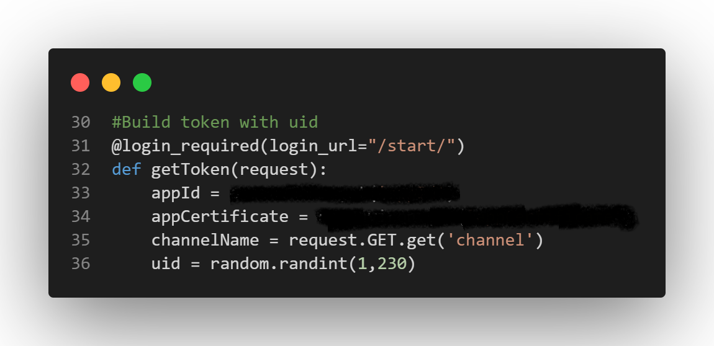
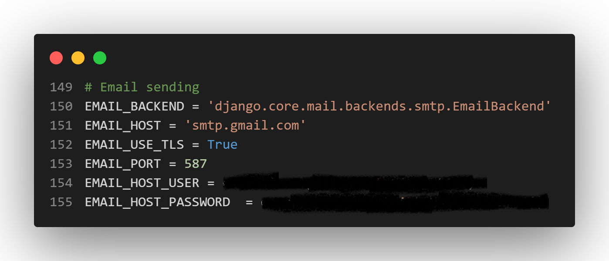

# Video Calling Web App

## Table of Contents

- [LIVE DEMO](#Live-Demo-link)
- [Project overview](#Project-overview)
- [Technology](#Technology)
- [Key Features](#Key-Features)
- [How to run application locally ?](#How-to-run-application-?)
- [How webRTC (agora) works ?](#How-webRTC-(agora)-works-?)

<div id="Live-Demo-link"/>

### [Live Demo link](https://webvc.up.railway.app)

<div id="Project-overview"/>

### Project overview:
This project is a web video calling application that utilizes the [Agora Real-Time Communication (RTC) SDK](https://www.agora.io/en/) to enable real-time video communication between users. The application incorporates essential features such as user signup, forget password capability, password matching functionality for the signup page, and additional controls for the video call experience, including mic mute/unmute, camera mute/unmute, and end call functionality.

The application aims to provide a seamless and intuitive user experience for web-based video calling, with added functionality for user management and call control. By leveraging the Agora RTC SDK, it ensures reliable and efficient real-time communication between participants.

<div id="Technology"/>

### Technology:
1. WebRTC (agora)
2. Python (Django)
3. Database (PostgreSQL)
4. HTML, JavaScript, CSS, Bootstrap 
5. Host server on [railway](https://railway.app/)

<div id="Key-Features"/>

### Key Features:
1. **Video Calling:** The application allows users to initiate video calls with other participants in real time. It leverages the Agora RTC SDK to establish reliable and high-quality video communication.

2. **User Signup:** Users can create new accounts by registering their credentials, including username, email address, and password. The signup process ensures password matching functionality to validate accurate password input.

3. **Forget Password Capability:** If users forget their passwords, they can utilize the "Forget Password" feature to initiate a password reset process. This typically involves sending a password reset link or verification code to the user's registered email address.

4. **Mic Mute/Unmute:** During a video call, participants can easily control their microphone's audio input by toggling the mic mute/unmute functionality. This allows users to silence or enable their audio as desired.

5. **Camera Mute/Unmute:** Participants can control their camera's video feed during a video call. By using the camera mute/unmute functionality, users can turn off or resume their video streaming according to their preferences.

6. **End Call Functionality:** Users have the ability to terminate ongoing video calls using the end call feature. This action disconnects the call and returns participants to the application's main interface.

<div id="How-to-run-application-?"/>

### How to run application locally ?
#### 1 - Clone repo
```
 git clone https://github.com/ShubhamOulkar/webvc.git
```
#### 2 - Create/activate virtual environment in your current directory

#### 3 - Install requirements
```
pip install -r requirements.txt
```
#### 4 - change directory to mainfolders
```
cd mainfolders
```
#### 5 - User text editor to update following code
1. open **mainfolders/webvc/views.py** file and add appId and appCertificate from agora.
    **[How to get appID and appCertificate](https://docs.agora.io/en/voice-calling/reference/manage-agora-account?platform=web)**


2. open **mainfolders/webvc/static/webvc/js/strems.js** add APP_ID here as well.
```
const APP_ID = '**************'
const CHANNEL = sessionStorage.getItem('room')
const TOKEN = sessionStorage.getItem('token')...
```
3. open **mainfolders/mainfolder/settings.py** add EMAIL_HOST_USER(add user gmail) and EMAIL_HOST_PASSWORD.
    if you are using gmail then see [how to get gmail app password.](https://www.getmailbird.com/gmail-app-password/)


#### 6 - run following commands in terminal
```
python manage.py makemigrations
```
```
python manage.py migrate
```

#### 7 - Start server
```
python manage.py runserver
```


<div id="How-webRTC-(agora)-works-?"/>

### How webRTC (agora) works ?